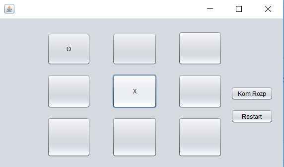

# projekty
Program ten pozwala nam na gre w kółko i krzyżyk z komputerem. Komputer oblicza następne ruchy za pomocą algorytmu min max. Na początku
plansza jest pusta, a gracz ma możliwość wykonania następnego ruchu klikajac w jeden z 9 przycisków, albo kliknięcia "Kom Rozp", który 
sprawi, że komputer rozpocznie.

W tym przypadku ruch zostal wykonany przez gracza, więc komputer na niego odpowiada (gracz jest X). 

Gra toczy się do momentu, aż jeden z graczy nie przegra albo nie dojdzie do remisu. Komputer został napisany w ten sposób, że nigdy nie przegra.

Plansza może zostać zresetowana za pomocą przycisku "Restart" 
